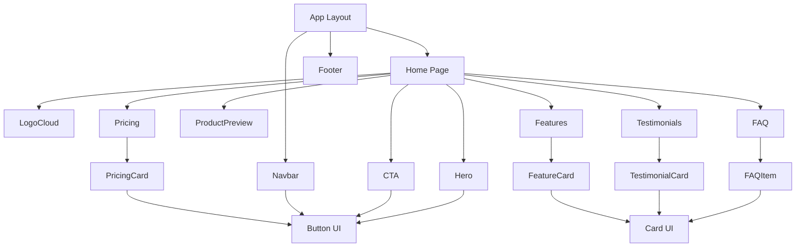

# Component Structure

## Explanation

The root layout wraps every page with the **Navbar** and **Footer**. The home page composes eight section components in sequence.

Section components render specialized card subcomponents (**FeatureCard**, **PricingCard**, **TestimonialCard**, **FAQItem**) that share reusable UI primitives from `components/ui/`:

- **Button** — Primary, secondary, and outline variants for CTAs
- **Card** — Glassmorphism container with hover states
- **Badge** — Section labels and status indicators
- **Section** — Consistent padding and max-width wrapper

Content data is imported from `data/` files, keeping components focused on presentation.
