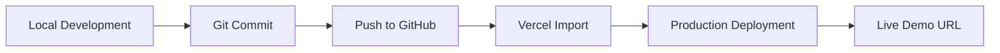

# Deployment



## Deployment Steps

1. **Build locally** with `pnpm build` to verify the project compiles without errors.
2. **Push to GitHub** — commit all changes and push to the `01-ai-saas-landing` repository.
3. **Import repository into Vercel** — connect your GitHub account and select the project.
4. **Deploy with default Next.js settings** — no custom build command required.
5. **Copy the live production URL** from the Vercel dashboard.
6. **Replace** `https://your-vercel-link.vercel.app` in `README.md` and `.env.example` with your production URL.
7. **Add the live URL** to the GitHub repository About section (Website field).
8. **Add the live URL** to your portfolio hub and LinkedIn post.

## Environment Variables

| Variable | Description |
|----------|-------------|
| `NEXT_PUBLIC_SITE_URL` | Production site URL for metadata and Open Graph tags |

Copy `.env.example` to `.env.local` for local development:

```bash
cp .env.example .env.local
```

## Recommended Vercel Settings

| Setting | Value |
|---------|-------|
| Framework Preset | Next.js |
| Build Command | `pnpm build` (or default) |
| Output Directory | `.next` (default) |
| Install Command | `pnpm install` |
