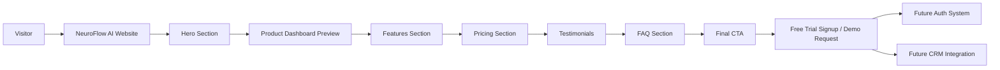

# System Overview

## Explanation

A visitor lands on the NeuroFlow AI marketing site and moves through a structured conversion funnel. Each section builds understanding and trust before asking for commitment.

The **hero** establishes the value proposition. The **product dashboard preview** shows what the platform looks like in practice. **Features** and **pricing** answer "what do I get?" and "what does it cost?" **Testimonials** and **FAQ** reduce objections. The **final CTA** drives trial signup or demo requests.

In a production deployment, signup actions would connect to an authentication system and CRM for lead management. This repository implements the marketing layer; backend integrations are documented as future improvements.
