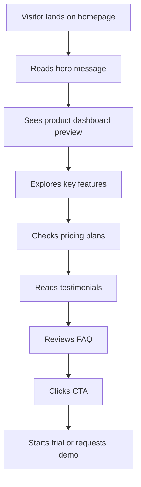

# User Flow

## Explanation

The conversion flow is designed to move visitors from awareness to action in a single scroll session.

1. The **hero** captures attention with a clear headline and immediate CTAs for visitors ready to convert early.
2. The **product preview** provides visual proof and reduces uncertainty about what they are signing up for.
3. **Features** and **pricing** help evaluators build an internal business case.
4. **Testimonials** and **FAQ** address social proof and common objections.
5. The **final CTA** gives a last conversion opportunity before the footer.

Visitors can enter the funnel at any CTA point (navbar, hero, pricing cards, or bottom CTA). All paths lead to trial signup or demo request.
